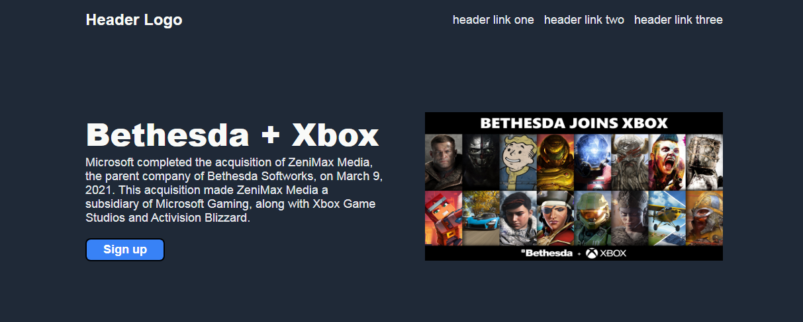

# first-landing-page

> Learning about flexbox

## Built With

- Major languages
- Frameworks
- Technologies used

## Live Demo

[Live Demo Link]( https://diegoredondo1702.github.io/first-landing-page/)

## Getting Started

To start, we enter our browser and place github to enter my repositories, copy the code, enter the local disk c and then look for the odin folder, enter it and then open git bash and make a git clone

### Prerequisites

### Setup

### Install

### Usage

### Run tests

### Deployment

## Authors

👤 **Diego Redondo**
Github: [DiegoRedondo1702](https://github.com/DiegoRedondo1702)
## 🤝 Contributing

Contributions, issues, and feature requests are welcome!

Feel free to check the [Issues](https://github.com/DiegoRedondo1702/first-landing-page/issues).
## Show your support

Give a ⭐️ if you like this project!

## Acknowledgments

-I thank uneweb.

## 📝 License

This project is [CC0 1.0 Universal](LICENSE) licensed.
